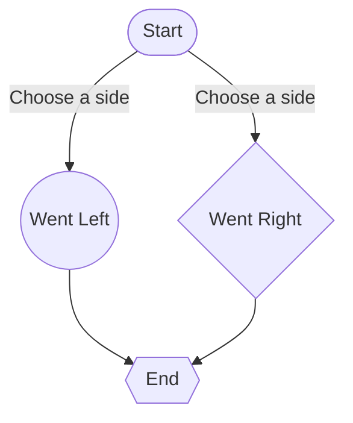

# **Assignment3**
## **Jessica Schemmel**
### **Experience using markdown to improve Readme.md files**
- Flowchart
- Sequence Diagram
- Gantt Diagram
- Class Diagram

[Documentation](https://github.com/adam-p/markdown-here/wiki/Markdown-Cheatsheet#headers)

:yellow_heart: :alien: :sparkles:

|header1|header2|header3|
|:---|:---:|---:|
|1|2|3|
|4|5|6|

[Image](https://mermaid.js.org/header.png)

```Java 
System.out.println("Hello, world");
System.out.println("Hello world again!");
```

